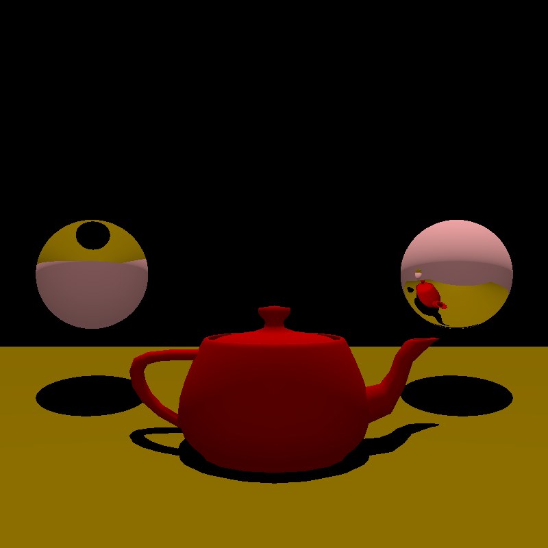

# Raytracer Engine

<!-- ABOUT THE PROJECT -->
## About The Project

This is a fully working Raytracer Engine made entirely from scratch only using Java

### Example
 

<!-- GETTING STARTED -->
## Getting Started

To get a local copy up and running follow this simple steps.

1. Download the whole project as a ZIP file or with your favorite method
2. Setup the enviroment with the latest one
3. You are now able to run the project without any problems

### Prerequisites

The only prerequisites for this project is to have a Java 11.0.13 or the latest Java update.

<!-- CONTRIBUTING -->
## Contributing

Contributions are what make the open source community such an amazing place to learn, inspire, and create. But for this project contributions are turned off.

<!-- LICENSE -->
## License

Distributed under the MIT License.

<!-- CONTACT -->
## Contact

Raschid Llamas Aun - [@nft_rshdd](https://twitter.com/nft_rshdd) - raschidllamas@hotmail.com

Project Link: [https://github.com/rshdd/RaytracerEngine](https://github.com/rshdd/RaytracerEngine)
